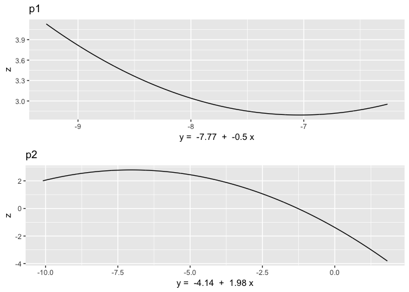

A Second Example of Polynomial Regression
================
Nehemias Ulloa
2017-08-09

Introduction
------------

This guide will walk you through the usage of polynomial regression as advocated by Edwards and Parry, 1993 i.e. fit the quadratic polynomial regression model,

*z* = *β*<sub>0</sub> + *β*<sub>1</sub>*x* + *β*<sub>2</sub>*y* + *β*<sub>3</sub>*x*<sup>2</sup> + *β*<sub>4</sub>*x**y* + *β*<sub>5</sub>*y*<sup>2</sup> + *ϵ*

as well as get the output for the key components.

Just like in our first [example](Examples/Examples.md), load these packages (or install if you don't have them already).

``` r
library(foreign)
library(ggplot2)
library(reshape2)
library(gridExtra)
library(plotly)
```

Setup variables
---------------

So for this example we will walk through the results in my creative component. The variables are outlined below:

-   *Z*<sub>*i*</sub> - Obs RQ of couple *i*: 1 − 9
-   *Y*<sub>*i*</sub> - Wife (*i*)'s Report of RI: } 1 − 6
-   *X*<sub>*i*</sub> - Husband (*i*)'s Report of RI: 1 − 6

FYI, the variables are centered in order to make interpretations easier.

Here is where we read in the data

``` r
x <- d$HHhostW0 - 3.5
y <- d$WHhostW0 - 3.5
z <- d$OHrqW0 - 5
```

Here we fit the quadratic regression model

``` r
QF <- lm(z ~ x + y + I(x^2) + I(x*y) + I(y^2), data=d)
```

We have the function **statpt** that will grab the stationary point

``` r
statpt <- function(lm){
  ## Takes a quadratic lm function
  ## coef(lm) gives a vector of all the parameter estimates in the linear model
  ## So here we are grabbing the individual parameter estimates from that vector
  b0 <- as.numeric(coef(lm)[1])
  b1 <- as.numeric(coef(lm)[2])
  b2 <- as.numeric(coef(lm)[3])
  b3 <- as.numeric(coef(lm)[4])
  b4 <- as.numeric(coef(lm)[5])
  b5 <- as.numeric(coef(lm)[6])
  
  ## Stationary Pts. using the formulas in Eq 10 & 11
  x0  <- (b2*b4 - 2*b1*b5)/(4*b3*b5 - b4^2)
  y0  <- (b1*b4 - 2*b2*b3)/(4*b3*b5 - b4^2)
  
  ## Output
  #out <- matrix(c(x0, y0), ncol=2)
  #colnames(out) <- c("x0","y0")
  out <- data.frame(x0=x0, y0=y0)
  return(out)
}

statpt(QF)
```

    ##          x0        y0
    ## 1 -1.459618 -7.034456

We can get the predicted response at the stationarity point

``` r
x0 <- statpt(QF)$x0
y0 <- statpt(QF)$y0
predstatpt <- as.numeric(coef(QF)[1] + coef(QF)[2]*x0 + coef(QF)[3]*y0 + coef(QF)[4]*x0^2 + coef(QF)[5]*x0*y0 + coef(QF)[6]*y0^2)
predstatpt
```

    ## [1] 2.79403

We can also get the principal axis using our function **paxis**

``` r
paxis <- function(lm){
  ## Takes a quadratic lm function just as the function before and just as before
  ## coef(lm) gives a vector of all the parameter estimates in the linear model
  ## So here we are grabbing the individual parameter estimates from that vector
  b0 <- as.numeric(coef(lm)[1])
  b1 <- as.numeric(coef(lm)[2])
  b2 <- as.numeric(coef(lm)[3])
  b3 <- as.numeric(coef(lm)[4])
  b4 <- as.numeric(coef(lm)[5])
  b5 <- as.numeric(coef(lm)[6])
  
  ## Stationary Pts.
  x0  <- (b2*b4 - 2*b1*b5)/(4*b3*b5 - b4^2)
  y0  <- (b1*b4 - 2*b2*b3)/(4*b3*b5 - b4^2)
  
  ## First Principal axis
  p11 <- (b5 - b3 + sqrt((b3 - b5)^2 + b4^2))/b4 #slope
  p10 <- y0 - p11*x0 #intercept
  
  ## Second Principal axis
  p21 <- (b5 - b3 - sqrt((b3 - b5)^2 + b4^2))/b4
  p20 <- y0 - p21*x0
  
  ## Output
  out <- data.frame(p10=p10, p11=p11, p20=p20, p21=p21)
  return(out)
}

paxis(QF)
```

    ##         p10        p11       p20      p21
    ## 1 -7.769813 -0.5038009 -4.137245 1.984911

And the plot them using **principal\_plot\_surface**

``` r
principal_plot_surface <- function(pax, lm){
  require(ggplot2)
  require(reshape2)
  require(gridExtra)
  x_temp <- seq(-3,3,length.out= 1000)
  y_p1 <- pax$p10 + pax$p11*x_temp
  y_p2 <- pax$p20 + pax$p21*x_temp
  
  x <- x_temp
  y <- y_p1
  pred1 <- predict(lm, data.frame(x,y,x^2,x*y,y^2))

  x <- x_temp
  y <- y_p2
  pred2 <- predict(lm, data.frame(x,y,x^2,x*y,y^2))

  a <- ggplot() + geom_line(aes(x=y_p1, y=pred1)) + labs(x=paste("y = ", round(pax$p10,2), " + ", round(pax$p11,2), "x"), y="z", title="p1")
  b <- ggplot() + geom_line(aes(x=y_p2, y=pred2)) + labs(x=paste("y = ", round(pax$p20,2), " + ", round(pax$p21,2), "x"), y="z", title="p2")
  grid.arrange(a, b)
}

principal_plot_surface(paxis(QF), QF)
```



Lastly, here is the predicted surface plot using **plotly**

``` r
n     <- 100
xp    <- seq(-2.5,2.5,length.out= n)
y    <- seq(-2.5,2.5,length.out= n)
preds <- matrix(rep(0, n))

for(i in 1:n){
  x <- rep(xp[i], times=n)
  preddat <- data.frame(x, y, x^2, x*y, y^2)
  preds   <- cbind(preds, as.numeric(predict(QF, preddat)))
}
predictions <- list(x=xp,y=y, z=preds[,-1])

p <- plot_ly(x=xp, y=y, z=preds[,-1]) %>% add_surface()
```

For some reason **plotly** doesn't like to play nice with markdown files but I've included a screenshot of the surface below and you can visit the surface [here](https://plot.ly/~nulloa1/150/)
</center>

</center>
